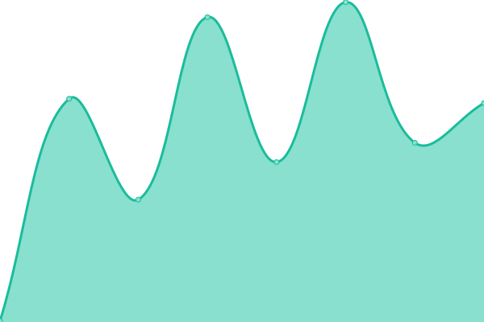

# [📈 Live Status](https://status.toonstorytime.me): <!--live status--> **🟩 All systems operational**

This repository contains the open-source uptime monitor and status page for [Cartoon Kritthapath Yaviraj](toonstorytime.me), powered by [Upptime](https://github.com/upptime/upptime).

With [Upptime](https://upptime.js.org), you can get your own unlimited and free uptime monitor and status page, powered entirely by a GitHub repository. We use [Issues](https://github.com/toonnongaeoy/site-uptime/issues) as incident reports, [Actions](https://github.com/toonnongaeoy/site-uptime/actions) as uptime monitors, and [Pages](https://status.toonstorytime.me) for the status page.

<!--start: status pages-->
<!-- This summary is generated by Upptime (https://github.com/upptime/upptime) -->
<!-- Do not edit this manually, your changes will be overwritten -->
<!-- prettier-ignore -->
| URL | Status | History | Response Time | Uptime |
| --- | ------ | ------- | ------------- | ------ |
|  [Main Site.](https://toonstorytime.me) | 🟩 Up | [main-site.yml](https://github.com/toonoeichi/site-uptime/commits/HEAD/history/main-site.yml) | 

 964ms
     
 | 

<a href="https://status.toonstorytime.me/history/main-site">100.00%</a>
    

|  [Tree Site](https://tree.toonstorytime.me) | 🟩 Up | [tree-site.yml](https://github.com/toonoeichi/site-uptime/commits/HEAD/history/tree-site.yml) | 

 199ms
     
 | 

<a href="https://status.toonstorytime.me/history/tree-site">100.00%</a>
    

|  [Homelab (Cloudflare)](https://cloud.toonstorytime.me) | 🟩 Up | [homelab-cloudflare.yml](https://github.com/toonoeichi/site-uptime/commits/HEAD/history/homelab-cloudflare.yml) | 

 1922ms
     
 | 

<a href="https://status.toonstorytime.me/history/homelab-cloudflare">99.82%</a>
    

|  [Homelab (Direct)](http://7dd60789cb61.sn.mynetname.net) | 🟩 Up | [homelab-direct.yml](https://github.com/toonoeichi/site-uptime/commits/HEAD/history/homelab-direct.yml) | 

 1409ms
     
 | 

<a href="https://status.toonstorytime.me/history/homelab-direct">99.68%</a>
    

<!--end: status pages-->

[**Visit our status website →**](https://status.toonstorytime.me)

## 📄 License

- Powered by: [Upptime](https://github.com/upptime/upptime)
- Code: [MIT](./LICENSE) © [Anand Chowdhary](https://anandchowdhary.com), supported by [Pabio](https://pabio.com)
- Data in the `./history` directory: [Open Database License](https://opendatacommons.org/licenses/odbl/1-0/)
