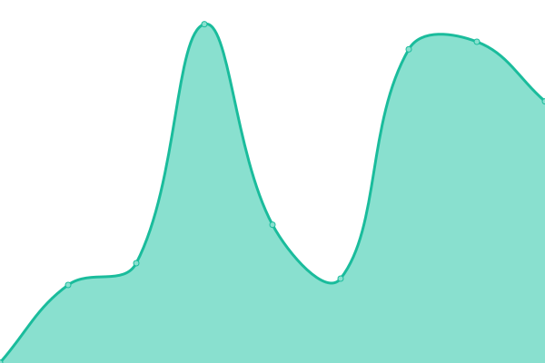
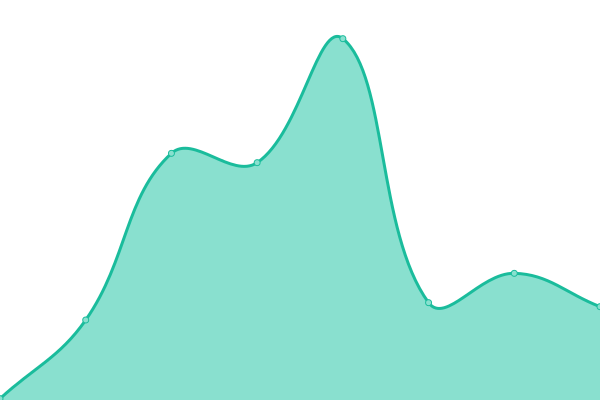
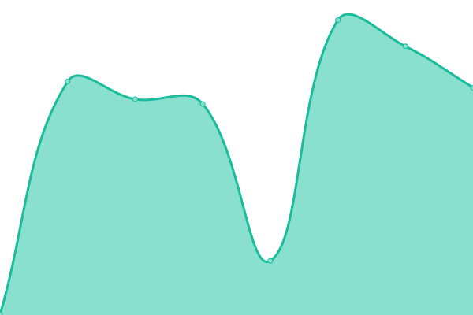
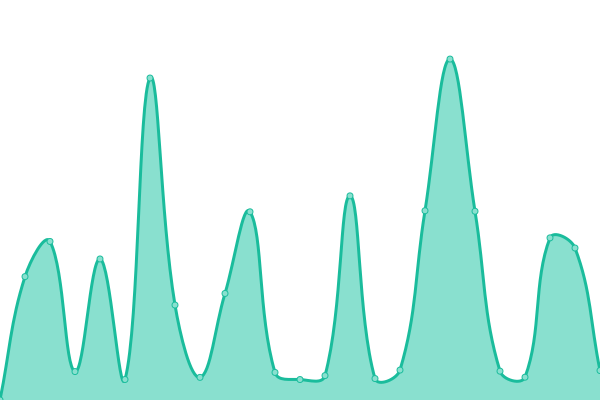

# [📈 Live Status](https://status.toonstorytime.me): <!--live status--> **🟧 Partial outage**

This repository contains the open-source uptime monitor and status page for [Cartoon Kritthapath Yaviraj](toonstorytime.me), powered by [Upptime](https://github.com/upptime/upptime).

With [Upptime](https://upptime.js.org), you can get your own unlimited and free uptime monitor and status page, powered entirely by a GitHub repository. We use [Issues](https://github.com/toonnongaeoy/site-uptime/issues) as incident reports, [Actions](https://github.com/toonnongaeoy/site-uptime/actions) as uptime monitors, and [Pages](https://status.toonstorytime.me) for the status page.

<!--start: status pages-->
<!-- This summary is generated by Upptime (https://github.com/upptime/upptime) -->
<!-- Do not edit this manually, your changes will be overwritten -->
<!-- prettier-ignore -->
| URL | Status | History | Response Time | Uptime |
| --- | ------ | ------- | ------------- | ------ |
|  [Main Site.](https://toonshou.in) | 🟩 Up | [main-site.yml](https://github.com/toonshouin/site-status/commits/HEAD/history/main-site.yml) | 

 680ms
     
 | 

<a href="https://status.toonshou.in/history/main-site">100.00%</a>
    

|  [Linktree.](https://card.toonshou.in) | 🟩 Up | [linktree.yml](https://github.com/toonshouin/site-status/commits/HEAD/history/linktree.yml) | 

 179ms
     
 | 

<a href="https://status.toonshou.in/history/linktree">100.00%</a>
    

|  [Blog Site.](https://blog.toonshou.in) | 🟩 Up | [blog-site.yml](https://github.com/toonshouin/site-status/commits/HEAD/history/blog-site.yml) | 

 183ms
     
 | 

<a href="https://status.toonshou.in/history/blog-site">100.00%</a>
    

|  [Resume site.](https://resume.toonshou.in) | 🟩 Up | [resume-site.yml](https://github.com/toonshouin/site-status/commits/HEAD/history/resume-site.yml) | 

 580ms
     
 | 

<a href="https://status.toonshou.in/history/resume-site">100.00%</a>
    

|  [Retro Site.](http://legacy.toonshou.in) | 🟩 Up | [retro-site.yml](https://github.com/toonshouin/site-status/commits/HEAD/history/retro-site.yml) | 

 131ms
     
 | 

<a href="https://status.toonshou.in/history/retro-site">100.00%</a>
    

|  [Hackclub Scrapbook.](https://scrapbook.toonstorytime.me) | 🟥 Down | [hackclub-scrapbook.yml](https://github.com/toonshouin/site-status/commits/HEAD/history/hackclub-scrapbook.yml) | 

 0ms
     
 | 

<a href="https://status.toonshou.in/history/hackclub-scrapbook">0.00%</a>
    

|  [Homelab (Direct)](http://storyhouseproduction.duckdns.org) | 🟥 Down | [homelab-direct.yml](https://github.com/toonshouin/site-status/commits/HEAD/history/homelab-direct.yml) | 

 3619ms
     
 | 

<a href="https://status.toonshou.in/history/homelab-direct">92.70%</a>
    

|  [File Server (NAS)](https://files.toonshou.in) | 🟥 Down | [file-server-nas.yml](https://github.com/toonshouin/site-status/commits/HEAD/history/file-server-nas.yml) | 

 4076ms
     
 | 

<a href="https://status.toonshou.in/history/file-server-nas">0.00%</a>
    

|  [Bitwarden](https://pass.aoeyoei.xyz) | 🟩 Up | [bitwarden.yml](https://github.com/toonshouin/site-status/commits/HEAD/history/bitwarden.yml) | 

 1105ms
     
 | 

<a href="https://status.toonshou.in/history/bitwarden">100.00%</a>
    

|  [Immich Server](https://img.toonshou.in) | 🟥 Down | [immich-server.yml](https://github.com/toonshouin/site-status/commits/HEAD/history/immich-server.yml) | 

 3754ms
     
 | 

<a href="https://status.toonshou.in/history/immich-server">0.00%</a>
    

|  [Bluesky PDS](https://blue.toonshou.in) | 🟩 Up | [bluesky-pds.yml](https://github.com/toonshouin/site-status/commits/HEAD/history/bluesky-pds.yml) | 

 746ms
     
 | 

<a href="https://status.toonshou.in/history/bluesky-pds">100.00%</a>
    

|  [Speedtest (Homelab)](https://speed.aoeyoei.xyz) | 🟩 Up | [speedtest-homelab.yml](https://github.com/toonshouin/site-status/commits/HEAD/history/speedtest-homelab.yml) | 

 1095ms
     
 | 

<a href="https://status.toonshou.in/history/speedtest-homelab">100.00%</a>
    

<!--end: status pages-->

[**Visit our status website →**](https://status.toonstorytime.me)

## 📄 License

- Powered by: [Upptime](https://github.com/upptime/upptime)
- Code: [MIT](./LICENSE) © [Anand Chowdhary](https://anandchowdhary.com), supported by [Pabio](https://pabio.com)
- Data in the `./history` directory: [Open Database License](https://opendatacommons.org/licenses/odbl/1-0/)
